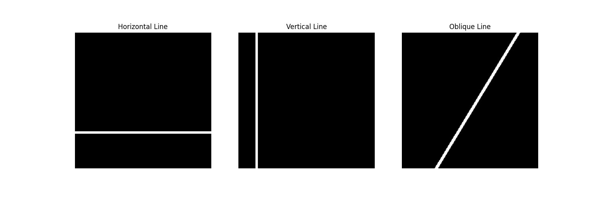
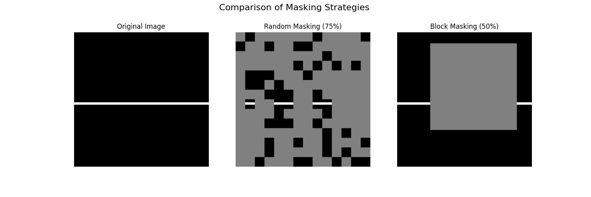

# DSAIT4205 Control Dataset

## Putting Masked Autoencoders to the Test: Is Random Masking Really the Secret?

### Introduction

The 2021 paper [Masked Autoencoders Are Scalable Vision Learners](https://arxiv.org/pdf/2111.06377.pdf) presents a simple, yet powerful, method for self-supervised learning. The main idea is to randomly mask a large portion of an input image and train a model to reconstruct the missing pixels. The authors make the following claim: the strategy used for masking is a key determinant of the representation quality. In particular, they find that simple, random patch masking works best, outperforming more structured strategies like block or grid masking.

Why is this interesting? The paper hypothesizes that random masking works because it creates a challenging task that largely eliminates spatial redundancy. This prevents the model from simply *cheating* by extrapolating from adjacent patches and forces it to learn more meaningful, *holistic* features. This project aims to create a controlled experiment to validate the Masked Autoencoders (MAE) paper's claim about masking strategies.

### The Problem with Natural Images

The MAE paper validates its claims on the complex ImageNet dataset. While powerful, this makes it difficult to know *for sure* why block masking is less effective; is the task too hard, or does block masking encourage the model to learn a simpler, less useful *local extrapolation* feature that doesn't generalize well?
In order to isolate these variables and "change only one variable" at a time, we need a controlled setting where local extrapolation is an obvious, easy solution.

### The Controlled Experiment: *Continuous Line* Dataset

To investigate this, I designed a synthetic *toy problem* dataset called **Continuous Line**. The dataset is purposefully simple: it consists of 224x224 pixel images, each containing a single white line on a black background. The line's position is randomized, and its orientation can be horizontal, vertical, or oblique (slanted at a random angle).

*Figure 1: Example images from the Continuous Line dataset, showing the three classes with randomized positions and angles.*

Why this design? It creates a scenario where the task of reconstruction can be solved in two different ways:

1. **Easy, Local Extrapolation:** If you remove a large, contiguous block from the middle of a line, the task of filling it in is trivial. The model only needs to connect the two visible endpoints. This is a low-level, simple feature to learn.
2. **Hard, Global Understanding:** If you poke many random, tiny holes in the line, the model can no longer rely on simple extrapolation. It must connect many disparate, non-contiguous points, forcing it to learn a more abstract, global concept of "what a continuous line is."

This setup allows us to directly test the hypothesis: Does block masking encourage the model to learn the "easy" local feature, while random masking forces it to learn the "harder" but more valuable global feature?

### Visualizing the Masking Strategies

The difference between the two masking strategies becomes starkly clear on our Continuous Line dataset. The visualization below, inspired by Figure 6 in the MAE paper, shows how **block masking** removes a single large chunk, leaving an easy-to-solve gap. In contrast, **random masking** creates a much more difficult puzzle that requires a global understanding to solve.

*Figure 2: A direct comparison of masking strategies. The task posed by random masking is visibly more complex than the simple completion task posed by block masking.*

### Experimental Setup and Expected Outcome

The experiment would proceed as follows:

1. Train two identical MAE models from scratch on the Continuous Line dataset.
    * **Model A:** Trained with **random masking** (75% ratio).
    * **Model B:** Trained with **block masking** (50% ratio).
2. **Hypothesis:** Model B (block masking) will achieve a very low reconstruction error quickly, but the learned features will be weak. Model A (random masking) will have a harder time with reconstruction, but will learn a more robust, global representation of "lines".
3. **Validation:** To test the "strength" of the learned features, we would freeze the encoders of both models and train a simple linear classifier on top of them. The task would be to classify an image as containing a *horizontal*, *vertical*, or *oblique* line.
4. **Expected Result:** We expect the classifier for Model A (random masking) to achieve significantly higher accuracy than the classifier for Model B (block masking). This would provide direct, controlled evidence that random masking, by creating a more challenging pretext task, produces more useful, generalizable features, just as the MAE paper claims.

### Code and Dataset

The Continuous Line dataset was generated using [this](data.ipynb) Jupyter notebook, also available [here](https://github.com/s4m77/DSAIT4205-Control-Dataset/blob/main/data.ipynb). Running the full notebook will generate the `data` directory.
